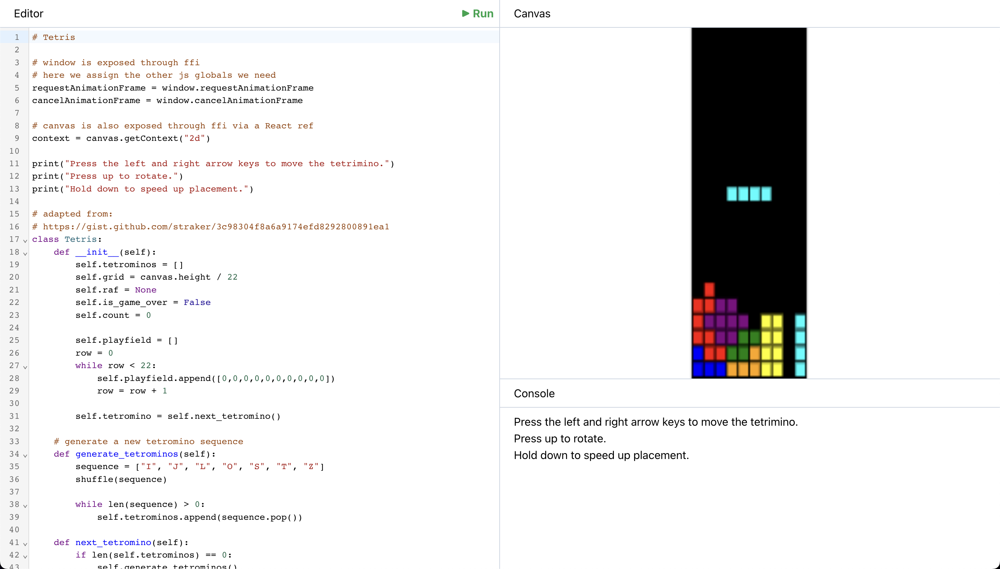

# Monty

Monty is a Python interpreter written in TypeScript made after reading [Crafting Interpreters](https://craftinginterpreters.com/) by Robert Nystrom. It supports a subset of Python including common primitive operations, lists, dicts, classes, inheritance, and async/await.

Monty also has seamless interop with JavaScript through an easy to use FFI. The browser based [playground app](https://nhjk.github.io/monty/#hello) is an example of this. Using the Monty Python interpreter you can easily write a canvas based browser game like [Tetris](https://nhjk.github.io/monty/#tetris). Minor downsides include being ~300x slower than regular Python.

